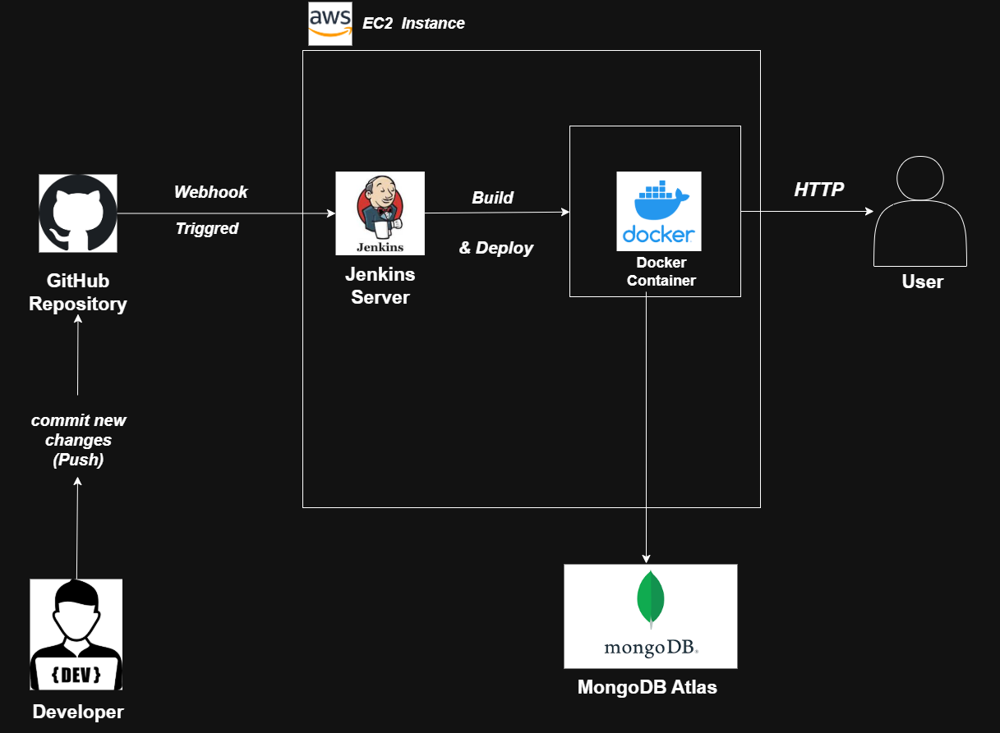

# Recipe Blog - Using Node.js + MongoDB + CICD Pipeline AWS EC2
## Create .env file
Create a .env file to store your MongoDB database credentials
Example only (copy the full connection string from MongoDB):
```
MONGODB_URI = mongodb+srv://<username>:<password>@cluster0.6m5cz.mongodb.net/
```
### Installation
To run this project, install it locally using npm:
```
$ npm install
$ npm start
```
#### Launch the AWS EC2 Instance 
##### Food Recipe Node.js App - Dockerized CI/CD Pipeline on AWS EC2
###### Project Objective
This project demonstrates a CI/CD pipeline using **Jenkins** and **Docker** to automatically deploy a Node.js application on an **AWS EC2** instance.  
Whenever code is pushed to **GitHub**, Jenkins builds a new Docker image, stops the old container, and runs the updated app.
## Architecture Diagram
  
*Flow: GitHub repo → Jenkins (EC2) → Docker build → Docker container → EC2 hosting → Web access*  > Tools used: draw.io
### Tech Stack & Justification
| Component      | Used For            | Why Chosen                                              |
|----------------|-------------------|--------------------------------------------------------|
| Node.js        | Web app backend    | Lightweight and widely used for REST APIs             |
| Docker         | Containerization   | Ensures consistent environment                         |
| Jenkins        | CI/CD automation   | Triggers build on GitHub push, automates deployment   |
| GitHub         | Version control    | Hosts code and triggers pipeline via webhook          |
| AWS EC2        | Hosting            | Free-tier instance to run Docker container            |
| MongoDB Atlas  | Database           | Cloud database for storing recipe data                |
### Prerequisites
- AWS EC2 instance running Ubuntu  
- Docker installed on EC2  
- Jenkins installed and configured  
- GitHub repository with Node.js app  
- Node.js and npm installed locally for testing

##### Limitations
 - MongoDB URI stored in .env file (can use Secrets Manager for production) 
 - No rollback mechanism implemented
 - Single EC2 instance, no auto-scaling
 - IaC (Terraform/CloudFormation) not used in this demo

 ### Future Improvement
 - Add rollback / Blue-Green deployment
 - Auto-scaling via ECS / Fargate
 - Secure credentials via AWS Secrets Manager
 - Implement automated tests in pipeline

 

#### Setup & Deployment Steps #
1. **Clone the repository:**
```bash
git clone https://github.com/Rinkumoni-kLita/RecipeBlog-MongoDB-Node.js.git

2. ** Build docker image manually:**

cd /var/lib/jenkins/workspace/FoodRecipeNodeJs
sudo docker build -t food-recipe-app .
sudo docker run -d -p 3000:3000 --name food-recipe-app food-recipe-app

4. ** Setups Jenkins Jobs : **

cd /var/lib/jenkins/workspace/FoodRecipeNodeJs
docker stop food-recipe-app || true
docker rm food-recipe-app || true
docker build -t food-recipe-app .
docker run -d -p 3000:3000 --name food-recipe-app food-recipe-app


5. **Automatic Deployment:**

Push code to GitHub → Jenkins triggers build automatically → New app version deployed.

#### Website

<PUBLIC_IP_ADDRESS>:3000
COOKING BLOG-HOME
okay


